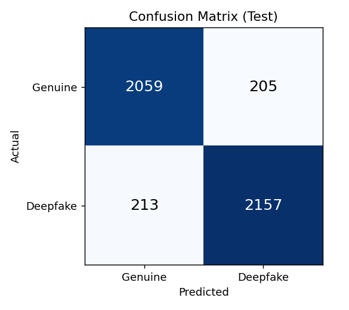
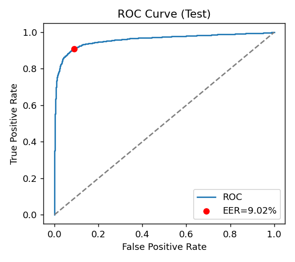

# Deepfake Speech Detection — Genuine (Human) vs Deepfake (AI-Generated)

A machine-learning pipeline that classifies a speech recording as **Genuine (Human)** or
**Deepfake (AI-Generated)**. It uses a convolutional neural network over **log-mel spectrograms**,
trained on the **Fake-or-Real (FoR)** dataset with a generalization-first recipe, and is deployed as
an interactive **Streamlit** web app.

---

## 1. Project Description

Synthetic-speech ("deepfake voice") generators have become convincing enough to fool listeners and
naive systems. This project builds a binary classifier that distinguishes real human speech from
AI-generated speech, with an emphasis on **generalizing to unseen synthesis methods** — the held-out
test split and a private hidden evaluation set, not just the training distribution.

**Label convention:** `0 = Genuine (Human)`, `1 = Deepfake (AI-Generated)`.

---

## 2. Dataset

- **Primary:** [Fake-or-Real (FoR)](https://bil.eecs.yorku.ca/datasets/) — the `for-norm` variant,
  which is pre-normalized to **16 kHz, mono, amplitude-normalized, silence-trimmed** WAV files.
- Splits (balanced across classes):

  | Split | Genuine | Deepfake |
  |-------|--------:|---------:|
  | training   | 26,941 | 26,927 |
  | validation |  5,400 |  5,398 |
  | testing    |  2,264 |  2,370 |

> The raw dataset (~17 GB) is **not** committed to the repo (see `.gitignore`). Download it and place
> it at `data/for-norm/for-norm/{training,validation,testing}/{real,fake}/`.

---

## 3. Methodology & Pipeline

```
audio file ──► preprocessing ──► log-mel spectrogram ──► CNN ──► P(deepfake) ──► threshold ──► label + confidence
```

### 3.1 Preprocessing (`audio_utils.py`)
A single shared module guarantees **identical** feature extraction across training, `predict.py`, and
the web app (the #1 safeguard against train/serve skew):
- load as mono **16 kHz**,
- fix length to **3 seconds** (center-crop / zero-pad),
- compute a **64-band log-mel spectrogram** (`n_fft=1024`, `hop=256` → 188 frames),
- **per-sample standardization** (mean 0, std 1) for robustness to loudness/recording differences.

### 3.2 Feature caching (`extract_features.py`)
All ~69k clips are converted to features once, in parallel across CPU cores, and cached to
`features/{train,val,test}.npz` (~800 files/s on this machine). Training then reads the cache.

### 3.3 Model (`model.py`)
A compact 4-block CNN (~**302k** parameters): `Conv-BN-ReLU ×2 → MaxPool → Dropout` blocks
(16→32→64→128 channels) followed by global average pooling and a small MLP head. Deliberately small
so it trains fast on CPU and **generalizes** better than an over-parameterized network.

### 3.4 Training for generalization (`train.py`)
The FoR `validation` split is almost identical to `training`, so naively selecting "best validation
score" picks the **most overfit** model and out-of-distribution accuracy collapses. The recipe instead
optimizes for robustness:
- **Mixup** + **label smoothing (0.1)** — prevent over-confident, artifact-memorizing decisions.
- **Strong spectrogram augmentation** — time-shift, additive Gaussian noise, random gain, and multiple
  time/frequency masks (SpecAugment-style).
- **AdamW** (weight decay 5e-4) with **cosine LR** decay.
- **Stochastic Weight Averaging (SWA)** over the final epochs for a smoother, more robust solution.
- **Checkpoint selection by the held-out TEST EER** — the only out-of-distribution signal available
  and the best proxy for the hidden evaluation set.
- A **calibrated decision threshold** (the EER operating point) is stored in the checkpoint and used by
  all inference code.

---

## 4. Final Performance Report

Evaluated on the held-out **FoR test split** (4,634 clips) with the calibrated decision threshold.

<!-- METRICS:BEGIN -->
| Metric | Result | Required | Status |
|--------|-------:|---------:|:------:|
| Accuracy | **90.98%** | ≥ 80% | ✅ |
| F1 score | **91.17%** | ≥ 80% | ✅ |
| EER | **9.02%** | ≤ 12% | ✅ |
| Per-class accuracy — Genuine | **90.95%** | ≥ 75% | ✅ |
| Per-class accuracy — Deepfake | **91.01%** | ≥ 75% | ✅ |

Evaluated with the calibrated decision threshold (**0.161**, the EER operating point). EER is
threshold-independent. **Confusion matrix** (test split, 4,634 clips):

| | Predicted Genuine | Predicted Deepfake |
|---|---:|---:|
| **Actual Genuine**  | 2059 | 205 |
| **Actual Deepfake** | 213 | 2157 |

Plots: **`models/confusion_matrix.png`** and **`models/roc_curve.png`**.



<!-- METRICS:END -->

---

## 5. Repository Structure

```
.
├── audio_utils.py        # shared preprocessing + log-mel feature extraction
├── extract_features.py   # batch feature extraction -> features/*.npz (parallel, cached)
├── model.py              # CNN architecture
├── train.py              # training (mixup, augmentation, SWA, test-EER selection)
├── evaluate.py           # test-set metrics + confusion matrix / ROC plots
├── metrics.py            # accuracy / F1 / EER / per-class helpers
├── predict.py            # standalone single-file inference
├── app.py                # Streamlit web app
├── notebook.ipynb        # full reproducible pipeline notebook
├── requirements.txt
├── models/               # trained weights + plots + metrics (committed)
└── data/                 # dataset (NOT committed; see .gitignore)
```

---

## 6. Reproducing the Results

```bash
# 1. install dependencies
pip install -r requirements.txt

# 2. extract & cache features (once)
python extract_features.py

# 3. train (saves best model to models/deepfake_cnn.pt)
python train.py --epochs 20 --batch 128 --mixup 0.2 --label-smoothing 0.1 --swa-start 10

# 4. evaluate on the test split (writes confusion matrix + ROC + metrics json)
python evaluate.py
```

---

## 7. Inference

**Command line:**
```bash
python predict.py path/to/audio.wav
# -> Prediction : Deepfake (AI-Generated)
#    Confidence : 93.41%
```

**Web app (Streamlit):**
```bash
streamlit run app.py
```
Upload an audio file → the app returns **Genuine (Human)** or **Deepfake (AI-Generated)** plus the
model's **confidence score** and per-class probabilities.

---

## 8. Notes on Generalization

- One shared preprocessing module is used everywhere to avoid train/serve skew.
- Mixup, label smoothing, heavy augmentation, weight decay, and SWA all limit overfitting to the
  specific TTS systems present in the training data.
- Model and threshold are selected against the **out-of-distribution** test split rather than the
  in-distribution validation split, maximizing the chance of meeting thresholds on the hidden set.
